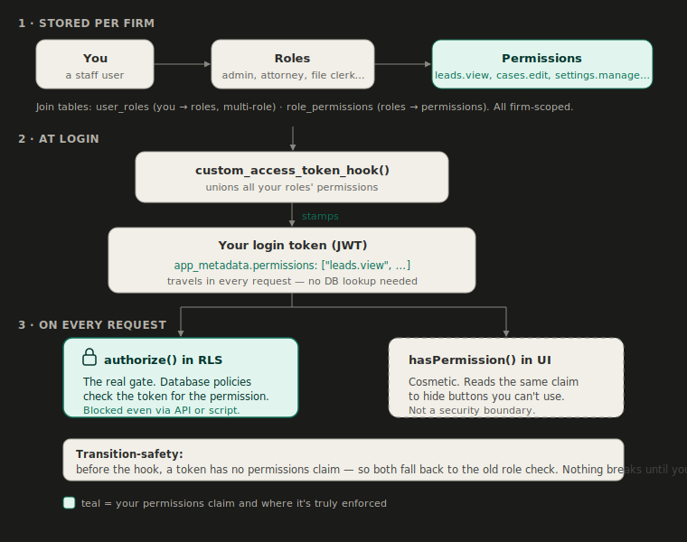

# 25 · Role-Based Access Control (RBAC)

> **Module:** `rbac` · **Status:** Draft · **Use cases:** UC25 · **Primary roles:** Admin
> **Supersedes:** the role *model* decided in [02-roles-and-permissions](02-roles-and-permissions.md)
> ("one base role per user + flags"). The role *list* and baseline matrix in 02 still stand — they
> become the seeded **system roles** here.

## Purpose

Replace the hardcoded `staff_role` enum + `can()` matrix (a v1 placeholder) with **data-driven
RBAC**: roles are rows (per firm, custom roles allowed), permissions are a controlled vocabulary,
a user may hold **one or more** roles, and admins **edit** which permissions each role grants — the
`/settings/roles` editor UC25 always implied.

Enforcement uses Supabase's recommended pattern: a **custom access-token hook** stamps the user's
effective permissions into the JWT, and RLS reads them via an `authorize(permission)` helper — no
per-row table joins. `firm_id` isolation is unchanged and remains the security floor; RBAC layers
on top.

This spec defines *how roles/permissions are modeled, assigned, edited, and enforced*. What each
staff role is responsible for stays in [02-roles-and-permissions](02-roles-and-permissions.md).

## Roles & permissions

| Role | Capability in this module |
|------|---------------------------|
| **Admin** (`settings.manage`) | Create/rename/delete custom roles, edit any role's permissions, assign roles to users. |
| All other roles | Hold assigned roles; no self-management. |

Tenant-scoped: an admin manages only roles/assignments within their own `firm_id` (RLS).

## Use cases

- **UC25 — Role & permission management.** Create a role; edit a role's permissions (per-module/
  action toggles); delete a role (only when unassigned and not a system role); assign **one or more**
  roles to a user; changes propagate. Shared with [22-admin-settings](22-admin-settings.md) and
  [24-user-management](24-user-management.md).

## Functional requirements

- **FR-rbac-1** — Roles are **data**: a `roles` row per firm, `is_system` for seeded ones. Admins
  create/rename/delete **custom** roles in their firm; **system roles cannot be deleted**.
- **FR-rbac-2** — Permissions are a **controlled vocabulary** (`app_permission`), action-grained and
  grouped by module (e.g. `leads.edit`, `cases.edit`, `billing.edit`, `documents.edit`,
  `reporting.view`, `users.manage`, `settings.manage`). New permissions are added by **migration**,
  never by users.
- **FR-rbac-3** — `role_permissions` maps roles → permissions and is **admin-editable** (the
  `/settings/roles` matrix). Changes are audit-logged.
- **FR-rbac-4** — A user may hold **one or more roles** via `user_roles`. **Effective permissions =
  the union** across all assigned roles.
- **FR-rbac-5** — Authorization is enforced by a Supabase **custom access-token hook** that injects
  the user's permission set into the JWT (`app_metadata.permissions`); RLS uses `authorize(perm)`
  reading `auth.jwt()`. Policies do **not** join RBAC tables per row.
- **FR-rbac-6** — `firm_id` isolation is unchanged; `authorize()` layers on top of the firm boundary,
  which stays the non-negotiable floor.
- **FR-rbac-7** — A role/permission change takes effect on the user's **next token refresh**; the
  change **forces a refresh** (or session revocation) so it propagates promptly rather than lagging
  to JWT expiry. *(See Open questions.)*
- **FR-rbac-8** — The **last-admin guard** is re-expressed: a firm must always retain **≥1 active
  user holding a role that grants `settings.manage`** (the admin-equivalent). Replaces the
  `role = 'admin'` check in migration 0006.
- **FR-rbac-9** — All role, permission, and assignment changes are **audit-logged** with actor + IP.
- **FR-rbac-10** — Every RBAC table has RLS: firm-scoped read; write only by a user with
  `settings.manage`.

## Data model

- **role** — `id`, `firm_id`, `key` (stable slug, e.g. `admin`), `name` (display), `is_system`,
  `created_at`.
- **app_permission** — enum of `module.action` values; the vocabulary referenced by policies.
- **role_permission** — `role_id`, `permission` (`app_permission`). PK `(role_id, permission)`.
- **user_role** — `user_id` (→ `auth.users`/`profiles`), `role_id`, `firm_id`. PK `(user_id, role_id)`.
- **profiles** — keeps identity/firm/status. The single `role` enum column is **retired** (authority
  moves to `user_role`); a denormalized `primary_role_id` for display is an open question.
- **custom_access_token_hook(event jsonb) → jsonb** — reads the caller's roles → permissions and
  sets `claims.app_metadata.permissions`. `security definer`, `search_path = ''`, **granted only to
  `supabase_auth_admin`** (revoked from `public`/`authenticated`). Registered in Supabase auth config.
- **authorize(permission app_permission) → boolean** — `stable`; true when the JWT's
  `app_metadata.permissions` contains `permission`.

## Enforcement model

1. User signs in (password **or** Google) → Supabase issues a JWT → the **access-token hook** runs →
   permission set stamped into `app_metadata.permissions`.
2. Requests hit Postgres carrying that JWT.
3. RLS: `using ( firm_id = current_firm_id() and authorize('cases.edit') )`.
4. The app UI mirrors with a client-side permission check to hide controls — **RLS is the real
   enforcement**, the UI check is cosmetic (same contract as today's `can()`).

## Screens

- `/settings/roles` *(needs `settings.manage`)* — role list; create/rename/delete **custom** roles
  (system roles locked); a per-role **permission matrix** editor (toggles grouped by module). This
  is the editor [22-admin-settings](22-admin-settings.md) references.
- `/settings/users` — assign **one or more** roles per user (role select → **multi-select**); shows
  each user's effective roles. Revises the single-role control built in
  [24-user-management](24-user-management.md).
- The **audit log** is viewed in [20-reporting-analytics](20-reporting-analytics.md).

## Migration / back-compat

1. Seed the 9 current `staff_role` values as `is_system` roles per firm.
2. Seed `role_permission` to reproduce today's `can()` matrix + the 02 module matrix (behaviour
   preserved).
3. Backfill `user_role` from each `profiles.role`.
4. Register the hook + add `authorize()`; rewrite RLS policies, `current_staff_role()` usages, the
   `can()` matrix, and the **0006 last-admin guard** against the new model.
5. Retire `profiles.role` once nothing reads it.

## Acceptance criteria

- [ ] An admin creates a custom role, toggles its permissions, and assigns it to a user.
- [ ] A user with two roles receives the **union** of both permission sets.
- [ ] RLS denies an action the user's roles don't permit, even if the UI is bypassed.
- [ ] A **system role** can't be deleted; a role with assigned users can't be deleted.
- [ ] A firm always retains ≥1 active user who can manage settings (admin-equivalent).
- [ ] A role/permission change reaches the user within one token refresh (forced on change).
- [ ] Every RBAC change is audit-logged; all RBAC tables are firm-scoped by RLS.

## Out of scope (v1) / future

- Per-resource / row-level grants (e.g. "this user on *this* case") — module/action level for v1.
- Permission *levels* (view/edit/full) as a separate axis — modeled as distinct `*.view` / `*.edit`
  permissions instead.
- Time-bound, delegated, or requestable roles.
- Cross-firm roles — folds into the future `memberships` migration sketched in
  [supabase/README.md](../supabase/README.md).

## Open questions

- **Claim freshness.** Exact propagation of a role change before natural JWT expiry: force
  `refreshSession()` client-side, revoke the user's sessions, or accept ≤ token-TTL lag. Proposed:
  force-refresh on change.
- **Permission vocabulary.** The initial `app_permission` set needs a pass against every module's
  real actions — the values above are representative, not final.
- Whether to keep a denormalized `profiles.primary_role_id` for display/sorting.

## Decisions (v1)

- **Data-driven RBAC** (`roles` / `app_permission` / `role_permissions` / `user_roles`),
  **superseding** 02's "one base role per user + flags".
- **Multiple roles per user**; effective permissions are the **union**.
- **Per-action permissions grouped by module** (not per-module levels).
- **Admin-editable** role→permission mappings; **per-firm custom roles**; seeded **system roles**.
- Enforced via a **custom access-token hook + `authorize()` in RLS** (Supabase's recommended RBAC
  pattern), not per-row table lookups.
- `firm_id` isolation unchanged.
- The hook + `authorize()` SQL will be **verified against Supabase's current RBAC guide** before
  implementation (per the repo's "read the docs first" rule).
